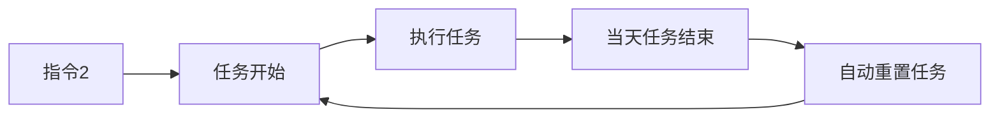
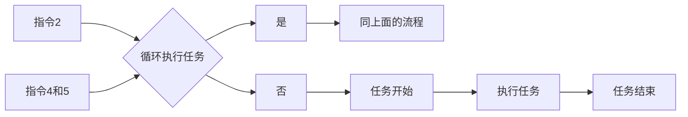

# DailyTask（本软件完全免费！近期发现有人在咸鱼私自倒卖本软件，请勿购买！如有购买，请联系卖家退款！另外，由于有人倒卖本工具，所以，Github不再提供安装包，如有能力可自行编译源码，否则进QQ群获取）

1. Kotlin+Java混编实现的打卡小工具，解决您上班途中迟到问题，只需一部备用手机置于公司工位，设置一下上下班打卡时间即可。
2. AutoDingDing（任务精灵）的升级版，相比于之前的版本，做了很多功能提升，但同样也做了版本兼容性调整，
   `此版本不再兼容8.0以下的系统`，最高兼容到Android 16 或者鸿蒙 4.0系统。
3. 此应用最开始的本意是方便自己，但后来本人换了新的单位，此款软件也就不用了，所以选择开源，
   有不到之处还请谅解。
4. 本应用仅限学习和内部使用，严禁商用和用作其他非法用途，如有违反，与本人无关！！！
5. **如果要用，请做好隐蔽工作，`不要被人发现`！如果被发现，后果自负。**

# 最新版本 2.2.5.2 —— 更新时间：2026年3月9日10点51分

#### 说几句：

1. 对目前功能不满意或者想加功能的，有能力的可以自行下载源码修改，也可以在群里反馈了等我发布新版本。
2. 手机不能灭屏。灭屏状态下，两个常驻通知服务可能会被系统干掉，会影响打卡。再一个就是锁屏后再解锁，并不会直接进入桌面，可能会无法调起软件。可以在主界面按音量
   `减小键`，会开启伪装灭屏模式。
3. 默认每天都会打卡，如果不需要可以发送`启动`和`停止`指令（其他指令，如：`打卡`、`电量`
   ），远程控制任务执行（大号给小号发，QQ、微信、支付宝、TIM都支持）。
4. **最后，在使用本软件之前，最好先自行测试几天，稳定确认没问题之后再使用，谢谢理解！**

#### 支持的远程指令：

| 序号 | 指令     | 功能                                  | 是否有邮件通知 |
|:---|:-------|:------------------------------------|---------|
| 1  | `电量`   | 查询当前手机/平板的电量                        | 是       |
| 2  | `启动`   | 启动循环任务（默认每天都会执行）                    | 是       |
| 3  | `停止`   | 停止循环任务（只会停止当天的任务）                   | 是       |
| 4  | `开始循环` | 循环任务标志位                             | 是       |
| 5  | `暂停循环` | 循环任务标志位（收到此指令后，会永远暂停执行，除非再次收到指令`4`） | 是       |
| 6  | `息屏`   | 开启伪灭屏模式                             | 否       |                                  | 否       |
| 7  | `亮屏`   | 退出伪灭屏模式                             | 否       |
| 8  | `考勤记录` | 导出当天的考勤记录                           | 是       |
| 9  | `打卡`   | 默认为“打卡”，如果自己修改过指令，按修改后的指令发送         | 否       |

注意：

- 如果要每天打卡，那就不必关注指令`4`和`5`。

- 如果要控制任务执行的日期，请结合指令`2`、`4`和`5`。

## 如果还有问题，请加QQ群，群内只回答没在此文档提到的问题，其余问题自行看文档，一定要仔细看完！！！：

- 560354109（①群）
- 643595483（②群）

#### [预更新——2.3.0.0]()

1. 支持用户选择需要唤起的软件
2. ✅添加企业微信消息通知渠道，可直接将原来的邮件通知转成企业微信推送

----------------------------------

#### [2.2.5.2版本更新日志]()

1. 支持导出/导入所有信息（任务+配置）
2. 部分界面添加免费声明水印
3. 适配Android 16状态栏

#### 收不到邮件的问题：

* 普通通知能收到，但是收不到打卡通知的，那可能是贵司管理员把打卡通知开关给关了。遇到这种情况的，要么老老实实手动打卡，
  要么依旧用此工具，只是收不到邮件罢了，问题也不是很大。
* 近来有不少用户提及，用久了会出现收不到打卡成功的邮件问题，后经排查——手机通知栏积累太多，通知栏被折叠，定期清理一下就好了。
* 之前测试能正常打卡，但是更新目标应用或者其他原因导致又收不到打卡通知了的，是因为目标应用消息收缩原因造成，需目标应用内更改相应的设置。

#### 已知的会被检测到作弊的原因：

| 序号 | 原因                             |
|:---|:-------------------------------|
| 1  | 手机已经root（被检测到作弊的概率极大）          |
| 2  | 使用了模拟定位软件试图修改打卡位置（被检测到作弊的概率极大） |
| 3  | 使用了向日葵等远程远程控制软件打开（被检测到作弊的概率极大） |
| 4  | 试图使用adb命定模拟手指点击打卡（被检测到作弊的概率极大） |
| 5  | 手机开启了无障碍服务                     |
| 6  | 手机数据线连着电脑                      |

#### 历史版本看这里：

| 版本号     | 版本说明                                                                                                                                                                                                                                                                                                         |
|:--------|:-------------------------------------------------------------------------------------------------------------------------------------------------------------------------------------------------------------------------------------------------------------------------------------------------------------|
| 2.0.0   | 1. 全新版本，全新的界面，全新功能！支持每日循环打卡，每日每次打卡时间会自动在设定的时间点5分钟内随机选择一个时间点打卡 2. 解决1.+版本遗留的问题                                                                                                                                                                                                                             |
| 2.0.1   | 1. 解决QQ邮箱、163邮箱、126邮箱、yeah邮箱发送邮件失败问题                                                                                                                                                                                                                                                                         |
| 2.0.2   | 1. 优化通知监听服务和通知缓存逻辑                                                                                                                                                                                                                                                                                           |
| 2.0.3   | 1. 修复倒计时任务进度条重叠问题 2. 优化小概率崩溃问题                                                                                                                                                                                                                                                                            |
| 2.0.4   | 1. 添加远程启动和停止每日任务功能（`此功能必须开启通知监听，否则指令无效`）。开始每日任务指令：`启动`。停止每日任务指令：`停止`。 2. 修复部分手机打完卡状态栏常亮问题                                                                                                                                                                                                                 |
| 2.0.5.1 | 1. 升级AGP，提升targetSdk到36（Android 15），适配Android 15版本新特性。 2. 更改数据持久化框架，使用官方Room框架                                                                                                                                                                                                                            |
| 2.0.6   | 1. 重构应用主题样式。 2. 增加自定义超时时间功能。 3. 优化循环任务启动和停止的逻辑与提示信息                                                                                                                                                                                                                                                    |
| 2.1.0   | 1. 优化邮件发送失败的错误处理和消息显示 2. 优化程序前台保活服务 3. 调整每日任务界面，去掉顶部实时计时显示 4. 新增随机时间开关，用户可自行控制是否需要生成随机任务时间点 5. 新增任务计时后台服务，解决任务计时延迟问题 6. 新增任务执行邮件通知 7. 新增伪灭屏状态下拦截电源键并添加时钟显示，让手机看起来更像是真的进入休眠                                                                                                                 |
| 2.1.1.0 | 1. 修改前台服务通知标题 2. 优化从目标应用返回软件主页面的逻辑 3. 优化保活服务和后台计时服务 4. 优化任务状态更新逻辑                                                                                                                                                                                                                                   |
| 2.2.0.0 | 1. 添加每日任务重置时间点设置，默认每天0点重置 2. 添加下拉刷新任务列表功能，解决删除任务小概率会失败的问题 3. 重构消息处理机制 4. 优化邮箱配置检查机制 5. 调整应用界面UI效果                                                                                                                                                                                                |
| 2.2.1.0 | 1. 主界面显示蒙层时，时钟颜色改为70%透明度白色，并添加随机变换时钟位置动画，降低烧屏风险 2. 修改通知邮件的任务时间为实际时间 3. 添加随机时间范围自定义功能，默认为5分钟                                                                                                                                                                                                            |
| 2.2.2.1 | 1. 删除悬浮窗开关，改为强制开启（不开启会导致无法进行循环任务） 2. 优化邮箱配置判断逻辑，改为不设置邮箱也能正常执行任务 3. 简化邮箱配置，去掉其他邮箱支持，发件箱只支持QQ邮箱                                                                                                                                                                                                          |
| 2.2.5.1 | 1. 重构应用主界面 2. 解决应用广播在Android 13以上版本无法收到的问题 3. 解决邮箱配置Session缓存导致邮件发送失败的问题 4. 解决因部分指令相同前缀导致指令错误执行的问题 5. 解决内部通信消息混乱的问题 6.优化每日任务执行和通知监听服务以及悬浮窗启动逻辑 7.优化伪灭屏显示效果 8.增加5条指令——【指令：`考勤记录`】、【指令：`息屏`】、【指令：`亮屏`】、【指令：`开始循环`】、【指令：`暂停循环`】 9.增加手势开启伪灭屏【单手指从上到下滑动——开启，单手指从下到上滑动——关闭】，并支持选择是否开启，默认关闭 |

# 使用步骤（**目标应用必须要设置为极速打卡**）：

1、打开应用，会自动检测悬浮窗权限，找到"DailyTask"软件，打开悬浮窗权限即可。如下图： 

2、在手机“设置”里面打开“通知中心”，然后找到“DailyTask”，点进去后打开“允许通知”开关。 

3、先设置好自己打卡结果接收邮件的邮箱，至于“邮件标题”和”超时时间（跳转到目标应用之后停留在目标应用界面上的时间）“以及”任务口令“，那就随意了，可自行调整也可按默认的来。如下图： 
 

3、在“设置”打开“通知监听”开关（如果未打开此开关，此开关底部会有一行红色小字）。找到"DailyTask"
软件，打开即可。如下图： 

4、如果想通过QQ，TIM、微信、支付宝消息唤起目标应用打卡，在“设置”界面点击“唤起测试”，确认以上应用是否有权限打开目标应用，如果不需要可以跳过此步骤，此处以QQ消息为例，其他类似，如下图： 

好了，基本设置就是这样了，附一张主页面。如下图： 

5、打卡结果如下：

| 打卡结果 | 说明                                                                          |
|:-----|:----------------------------------------------------------------------------|
| 成功   |                                                 |
| 失败   | 1.账号被自己另一个手机挤下去   2.未设置极速打卡   3.应用内部打卡通知或者手机通知被关闭   4.打卡手机有2个以上 |
